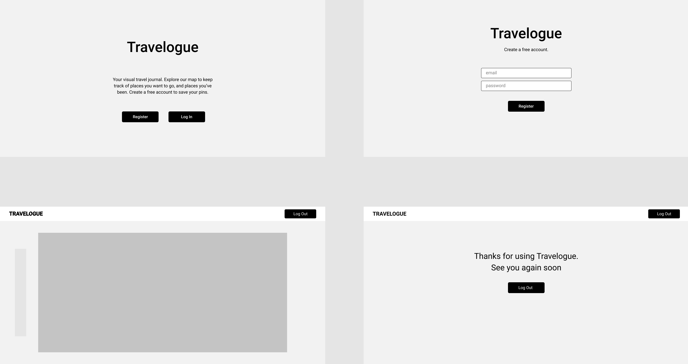
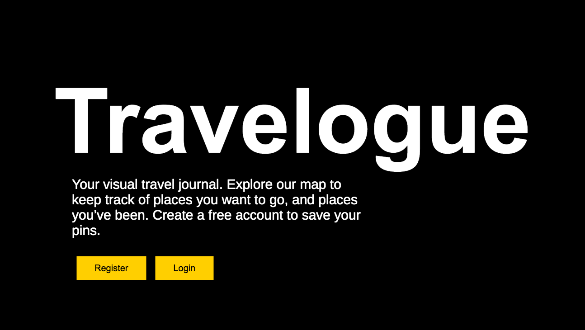
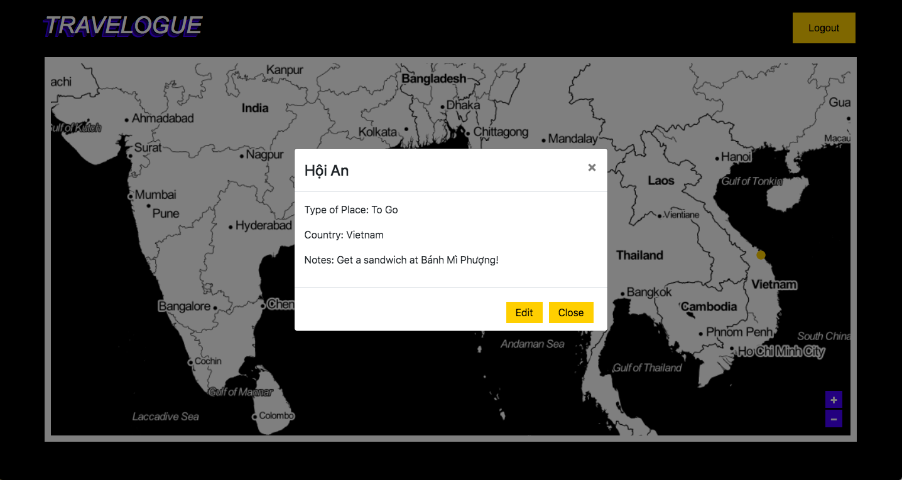
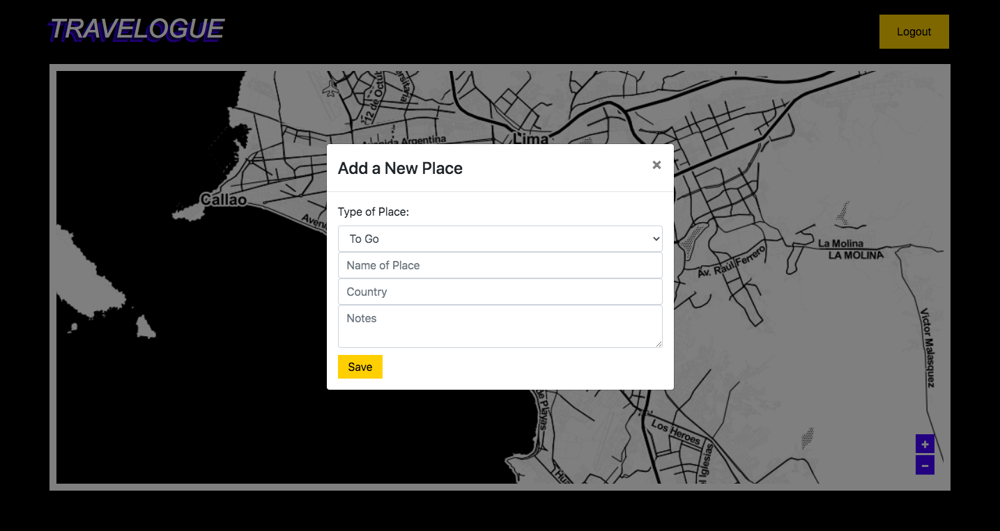

# Travelogue

### Epicodus Capstone Project

### By Kate Skorija

## Description
Travelogue is a visual resource for users to keep track of places they’ve been, and places they would like to go.
Users can explore a world map and place pins on locations, updating the pins with descriptions and notes as they wish. 
**Check out the deployed application: [Travelogue](https://travelogue-86d21.firebaseapp.com)!**
<br><br>
Map tiles by [Stamen Design](http://stamen.com), under [CC BY 3.0](http://creativecommons.org/licenses/by/3.0). Data by [OpenStreetMap](http://openstreetmap.org), under [ODbL](http://www.openstreetmap.org/copyright).
<br>

## User Stories
*  Users can navigate a world map.
*  Users can place pins on map to mark places they’ve been and places they would like to go.
*  Users can login to view previously saved pins.
*  Users can click on a placed pin to add, view, or update notes they’ve made about that place, or to delete that place.
<br>

## Component Diagram & Figma Mockups



<br>

## User Interface






## Set Up/Installation

To Clone:

1.  Navigate to the [travelogue respository](https://github.com/kate-skorija/travelogue) or open your terminal

2. Clone this project using the GitHub button or the command:
`$ git clone https://github.com/kate-skorija/travelogue.git`

3. Navigate to your `travelogue` directory in your editor of choice, or use [Visual Studio Code](https://code.visualstudio.com/)

4. Create a .env file in the root directory of your cloned project. This is where you will store your personal firebase information. The .env file has already been added to the .gitignore file of this repository.

5. Navigate to the [Google Firebase](https://firebase.google.com/). Create and account or login with your google account information. Click the "Create a Project" button, name your project, then click the `</>` symbol to add firebase to a new web application. Once you name your app, you'll be given a script that looks like this: 
  ```
  var firebaseConfig = {
    apiKey: "YOUR-UNIQUE-CREDENTIALS",
    authDomain: "YOUR-PROJECT-NAME.firebaseapp.com",
    databaseURL: "https://YOUR-PROJECT-NAME.firebaseio.com",
    projectId: "YOUR-UNIQUE-PROJECT-NAME",
    storageBucket: "YOUR-UNIQUE-URL",
    messagingSenderId: "YOUR-UNIQUE-CREDENTIALS",
    appId: "YOUR-UNIQUE-APPID"
  };
  ```
  These are the values you will need to place in your .env file, but first you will need to create the database. Click on the "Database" tab in the "Develop" pane on the left side of Firebase console and then click "Create database". Make sure you're choosing Firestore as your database option.

6. In your .env file, copy and paste your keys from firebase into environment variables like so:
  ```
  REACT_APP_FIREBASE_API_KEY = "YOUR-UNIQUE-CREDENTIALS"
  REACT_APP_FIREBASE_AUTH_DOMAIN = "YOUR-PROJECT-NAME.firebaseapp.com"
  REACT_APP_FIREBASE_DATABASE_URL = "https://YOUR-PROJECT-NAME.firebaseio.com"
  REACT_APP_FIREBASE_PROJECT_ID = "YOUR-PROJECT-FIREBASE-PROJECT-ID"
  REACT_APP_FIREBASE_STORAGE_BUCKET = "YOUR-PROJECT-NAME.appspot.com"
  REACT_APP_FIREBASE_MESSAGING_SENDER_ID = "YOUR-PROJECT-SENDER-ID"
  REACT_APP_FIREBASE_APP_ID = "YOUR-PROJECT-APP-ID"
  ```

7. Now you're ready to install. Type `$ npm install` in your terminal to install all webpack plugins and dependencies. Once finished, type `$npm run build`, then`$ npm start` to interact with the project in the browser.

## Minimum Viable Product Goals:

*  Users can navigate a world map easily (zoom, pan, etc).
*  Users can place pins on the map with a click, to mark places they’ve been and add places they would like to go.
*  Users can create a login and view their previously placed pins once logged in.
*  Users can click on a placed pin and create/read/update/delete notes for that place.

## Stretch Goals:

*  User's pin color will change based on if it is a place they've been, or a place they want to go.
*  Users can upload local photos to the places they have been, so they can look back on travel memories.
*  Users can access a user dashboard where they can browse their places in list form, and search through their places and notes.

## Known Bugs

In order for the pins to display correctly after they've been modified, the page currently has to refresh on the closing of the place modal. I hope to remedy this by adjusting how I am currently adding layers to the map.
<br>

## Support and Contact Details

If there are any issues or questions, please reach out to me through [my GitHub account](https://github.com/kate-skorija).
<br>

## Technologies Used

*  Git
*  CSS
*  JavaScript
*  JSX
*  React
*  Redux
*  Firebase / Firestore
*  OpenLayers API
*  Stamen 
*  Webpack
*  npm
<br><br>

### License

*This project uses the following license: [MIT](https://opensource.org/licenses/MIT)*

Copyright (c) 2020 **_Kate Skorija_** 